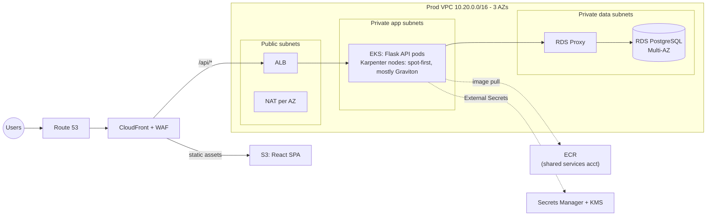
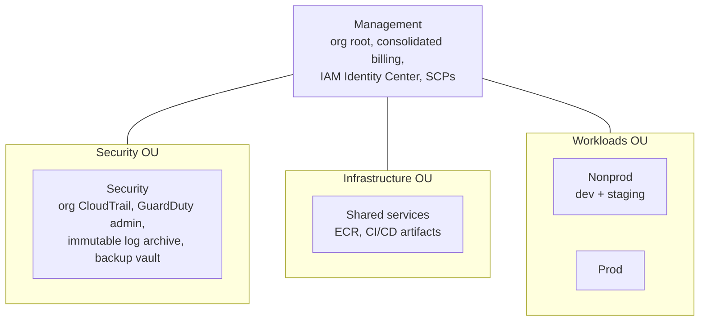
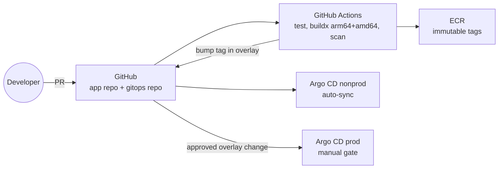

# Innovate Inc. - Cloud Architecture Design

Architecture proposal for Innovate Inc.'s web application on AWS: a React SPA,
a Python/Flask REST API, and PostgreSQL, built for a small team today and a
steep growth curve tomorrow.

## 1. Context and requirements

| Dimension | Requirement |
|---|---|
| Application | REST API backend (Python/Flask) + SPA frontend (React) |
| Database | PostgreSQL, sensitive user data |
| Traffic | Hundreds of users/day now; potential growth to millions |
| Team | Small, limited cloud experience |
| Delivery | CI/CD, frequent deployments |
| Non-functional | Robust, scalable, secure, cost-effective; managed Kubernetes |

Two forces shape every choice below: **the team is small** (so managed services
and low operational surface win by default) and **growth is uncertain but
potentially steep** (so nothing we build should need a rewrite at 100x traffic -
only bigger knobs).

## 2. Recommendations at a glance

| Area | Recommendation |
|---|---|
| Cloud | AWS, primary region eu-west-1 |
| Accounts | AWS Organizations, 5 accounts: management, security, shared services, nonprod, prod |
| Network | One VPC per workload account, 3 AZs, public / private-app / private-data subnet tiers |
| Compute | EKS + Karpenter (one multi-arch pool, spot-first; Graviton wins on price), small static system node group |
| Frontend | S3 + CloudFront (SPA is not served from the cluster) |
| CI/CD | GitHub Actions (build/test/scan) + Argo CD (GitOps deploy), multi-arch images in ECR |
| Database | RDS for PostgreSQL Multi-AZ + RDS Proxy; Aurora as the scale-up path |
| Security | WAF, org-wide CloudTrail/GuardDuty, KMS everywhere, Pod Identity, External Secrets |

### High-level diagram (production runtime)

## 3. Cloud provider: AWS

Both AWS and GCP can host this architecture well; this is a judgment call, not
a religious one.

**Why AWS.** The managed building blocks this design leans on - EKS with
Karpenter, RDS/Aurora for PostgreSQL, CloudFront/WAF, Organizations with SCP
guardrails - are the most mature versions of their kind. Graviton (arm64) plus
spot gives the best raw price/performance available for the stateless API tier.
The hiring pool and the body of operational knowledge around AWS are the
largest, which matters for a small team that will grow.

**The honest GCP counterpoint.** GKE Autopilot is the lowest-ops managed
Kubernetes on the market, and Cloud SQL for PostgreSQL is excellent. If
Innovate Inc. had a GCP-experienced founding engineer, this same design maps
one-to-one (GKE, Cloud SQL, Artifact Registry, Cloud CDN, projects instead of
accounts) and we would support that choice. Absent that, AWS is the safer
recommendation.

Primary region **eu-west-1** (Ireland): full service coverage including
Graviton spot depth, and EU data residency for the sensitive user data (adjust
to us-east-1/us-west-2 if the user base turns out US-centric - decide before
launch, migrations later are painful).

## 4. Cloud environment structure (accounts)

Five accounts under AWS Organizations. Accounts are AWS's only hard isolation
boundary - blast radius, IAM scope, service quotas and billing all follow the
account line, which is why environments get accounts, not just VPCs.

| Account | Purpose | Why separate |
|---|---|---|
| Management | Org root, consolidated billing, IAM Identity Center (SSO), SCPs. **No workloads, ever.** | Compromise of a workload must never touch org governance |
| Security | Org-wide CloudTrail, GuardDuty/Config delegated admin, S3 log archive (object lock), AWS Backup vault | Logs and backups must survive compromise of any other account (ransomware/insider case) |
| Shared services | ECR registry, CI/CD artifacts, later golden AMIs / internal tooling | Prod artifacts should come from neither prod nor nonprod; both envs pull the same immutable images |
| Nonprod | Dev + staging clusters and databases | Experimentation cannot page you at night or leak prod data |
| Prod | Production only | Tightest IAM, tightest network, cleanest cost line |

Practices that make this work for a small team:

- **IAM Identity Center from day 1** - humans get SSO roles, no IAM users, no
  long-lived keys. Permission sets: admin, developer, read-only.
- **Baseline SCPs**: deny leaving the org, deny disabling CloudTrail/GuardDuty,
  deny root-user actions, region allowlist (eu-west-1 + us-east-1 for
  CloudFront/ACM certificates).
- **Tagging standard** (env, service, owner, cost-center) enforced from the
  first resource; AWS Budgets alerts per account.
- Everything above is Terraform-managed (org, accounts, SCPs included).

Why not fewer? One account mixes blast radius and makes least-privilege IAM
practically impossible; two (prod/nonprod) leaves logs, billing control and
artifacts inside the accounts they are supposed to audit and supply. Why not
more? Per-team or per-service accounts (or Control Tower's full landing zone)
add governance overhead a five-person startup does not need yet; the structure
above grows into that shape without rework (split dev from staging, add a
sandbox OU, adopt Control Tower later if audit requirements demand it).

## 5. Network design

One VPC per workload account. No cross-VPC traffic exists today (the SPA is on
CloudFront, the API talks to its own database), so no peering/Transit Gateway
yet - non-overlapping CIDRs keep that door open.

| VPC | CIDR | Notes |
|---|---|---|
| Prod | 10.20.0.0/16 | 3 AZs |
| Nonprod | 10.10.0.0/16 | 3 AZs, dev + staging separated by subnets/namespaces |

Per-AZ subnet tiers (prod example):

| Tier | Example CIDRs | Contents | Internet path |
|---|---|---|---|
| Public | 10.20.0.0/24 x3 | ALB, NAT gateways | Internet Gateway |
| Private app | 10.20.16.0/20 x3 | EKS nodes and pods | Egress only, via NAT |
| Private data | 10.20.64.0/24 x3 | RDS, RDS Proxy, ElastiCache later | None |

Network security, layered:

- **Edge**: CloudFront in front of everything (single domain; `/api/*` origin
  is the ALB, everything else is the SPA bucket). AWS WAF on CloudFront:
  managed rule sets (core, known bad inputs, IP reputation) + rate limiting.
  Shield Standard is free; Shield Advanced when revenue justifies it.
  S3 access via Origin Access Control only - the bucket is never public.
- **Load balancer**: ALB in public subnets, TLS 1.2+ with ACM certificates,
  security group accepts 443 from CloudFront prefix lists only.
- **Compute**: nodes/pods in private subnets; security group chain
  ALB -> pods -> RDS Proxy -> RDS, each link allowing only its one port from
  the previous group. Kubernetes NetworkPolicies (VPC CNI native) add
  namespace-level segmentation inside the cluster.
- **Data**: data subnets have no internet route in either direction; RDS is
  not publicly addressable, ever.
- **Egress and endpoints**: NAT per AZ in prod (an AZ loss must not sever the
  survivors' egress), single NAT in nonprod (cost). VPC endpoints for S3, ECR,
  STS, CloudWatch and Secrets Manager - image pulls and telemetry never
  traverse NAT (cost) or the public internet (security).
- **EKS API endpoint**: prod private (reached via SSM port-forwarding or a
  lightweight Client VPN; CI reaches it through Argo CD running in-cluster, so
  the pipeline never needs the API from outside). Nonprod public with a tight
  CIDR allowlist for developer convenience.
- **VPC Flow Logs** shipped to the security account.

## 6. Compute platform

### Kubernetes: EKS, one cluster per workload account

- **Prod cluster** in the prod account; **one nonprod cluster** in nonprod with
  `dev` and `staging` namespaces (quotas + NetworkPolicies between them). A
  second nonprod cluster is warranted only when staging must mirror prod
  topology exactly for load tests.
- Managed control plane, version policy n-1 (upgrade one minor behind latest,
  quarterly cadence), access via IAM access entries mapped to Identity Center
  roles - no aws-auth ConfigMap, no shared credentials.
- Add-ons: VPC CNI, CoreDNS, kube-proxy, EKS Pod Identity agent, AWS Load
  Balancer Controller, External Secrets Operator, metrics-server.

### Node strategy (mirrors the POC in [`../terraform/`](../terraform/))

- A **small static managed node group** (2-3 Graviton on-demand nodes) hosts
  the cluster-critical layer: Karpenter, CoreDNS, Argo CD, observability
  agents. Tainted `CriticalAddonsOnly=true:NoSchedule` (mirrored in the POC):
  Karpenter and CoreDNS tolerate it out of the box, the other residents get
  the toleration in their Helm values, and workloads are repelled by policy.
- **Karpenter provisions all workload capacity**: one general NodePool
  spanning both architectures (`arch In [arm64, amd64]`), spot + on-demand
  with spot preferred. Flask is architecture-agnostic; with multi-arch images
  the price-ordered allocator lands on Graviton spot by default - a pure
  ~20-40% price/performance win with no per-workload effort.
- Stateless API pods ride spot with PodDisruptionBudgets and topology spread
  across AZs; anything disruption-sensitive (queues, schedulers, later
  stateful add-ons) pins `capacity-type: on-demand` via nodeSelector - policy
  per workload, not per cluster.
- Consolidation on: the cluster continuously bin-packs down to real usage.

### Scaling and resource allocation

- **HPA** on the API deployment (CPU-based day 1; request-latency or RPS via
  custom metrics once observability is in). HPA scales pods; Karpenter scales
  nodes to fit them - no node-group math, no ASG tuning.
- Requests/limits discipline: requests from observed p90 usage, memory
  limit = memory request, **no CPU limits** (avoid throttling); namespace
  ResourceQuotas + LimitRanges in nonprod keep experiments honest.
- PriorityClasses: system > api > batch, so node pressure evicts the right
  things first.

### Containerization and delivery

- **Images**: multi-stage Dockerfile (python-slim base, gunicorn, non-root
  user, read-only filesystem), built **multi-arch** (arm64 + amd64) with
  `docker buildx`. Immutable tags: `<git-sha>` plus a semver alias; `latest`
  is never deployed.
- **Registry**: ECR in the shared-services account, cross-account pull from
  both workload accounts, enhanced scanning (Inspector) on push, lifecycle
  policies expiring untagged/old images. Image signing (cosign) when the
  pipeline matures.
- **CI (GitHub Actions)**: on PR - lint, tests, image build, Trivy scan; on
  merge to main - push to ECR and bump the image tag in the environment
  overlay of the GitOps repo. CI authenticates to AWS with **GitHub OIDC
  federation - zero stored AWS keys**.
- **CD (Argo CD, GitOps)**: Argo CD in each cluster watches the GitOps repo
  (Kustomize overlays per environment). Nonprod auto-syncs on merge; prod
  syncs behind a manual approval (PR review on the prod overlay). Rollback is
  `git revert`. Drift is visible and auto-corrected. Argo Rollouts adds canary
  deployments when traffic justifies it.

**Why Kubernetes at all for a startup this size?** Fair challenge. The client
asked for managed Kubernetes, and the growth profile justifies it: the jump
from hundreds to millions of users changes capacity, not architecture, on this
platform. If Kubernetes were not a requirement, ECS Fargate or App Runner
would be a leaner day-1 choice - we say that openly, and the containerization
work transfers wholesale if the client ever prefers it.

## 7. Database: PostgreSQL

### Recommendation: Amazon RDS for PostgreSQL, Multi-AZ, with RDS Proxy

**Why RDS (and not the alternatives):**

- **Not self-managed on EKS**: running the database that holds sensitive user
  data on Kubernetes means owning replication, failover, backup integrity and
  upgrades with a small team. This is exactly the undifferentiated heavy
  lifting managed services exist to remove. Hard no.
- **Not Aurora on day 1**: Aurora is the right scale-up destination, but at
  hundreds of users it costs meaningfully more (instance premium plus I/O
  pricing that is hard to predict pre-launch) for capabilities this stage does
  not need. RDS -> Aurora is a well-trodden, low-risk migration (snapshot
  restore or logical replication) when triggers fire: sustained read pressure
  needing more than a couple of replicas, or storage and I/O growth where
  Aurora's model wins.
- **RDS Multi-AZ** gives synchronous standby in a second AZ, automatic
  failover in roughly 60-120 seconds, patching within maintenance windows, and
  zero replication engineering. (The Multi-AZ *cluster* variant - two readable
  standbys, ~35s failover - is the middle step if read scaling or
  failover-time pressure arrives before Aurora does.)
- **RDS Proxy from day 1**: Flask under gunicorn across dozens of
  autoscaling pods exhausts PostgreSQL connections fast (each connection costs
  server memory). The proxy pools and multiplexes, absorbs failover without
  connection storms, and removes the classic "we scaled the API and killed the
  DB" incident.

Sizing at launch: `db.m7g.large` Multi-AZ (Graviton again), gp3 storage with
autoscaling enabled. Small, honest, and two clicks from bigger.

### Backups

- Automated backups **with PITR**, 14-day retention: restore to any second in
  the window (WAL-based), RPO in normal operation ~5 minutes.
- **AWS Backup** copies snapshots cross-account into the security account's
  vault (vault lock on): backups survive prod-account compromise, the
  ransomware scenario.
- **Quarterly restore drills** into nonprod: a backup that has never been
  restored is a hope, not a backup. Drill output: measured restore time that
  feeds the RTO numbers below.

### High availability and disaster recovery

| Scenario | Mechanism | RPO | RTO |
|---|---|---|---|
| AZ failure | Multi-AZ automatic failover (+ RDS Proxy absorbing reconnects) | ~0 | 1-2 min |
| Bad deploy / data corruption | PITR to point before the event | minutes | < 1 h |
| Prod account compromise | Cross-account vault copy, restore into clean account | <= 24 h | hours |
| Region failure | Pilot light: cross-region snapshot copies + IaC redeploy of the stack | <= 1 h (snapshot cadence) | ~4 h |

Region failure is deliberately the cheapest tier today - a startup with
hundreds of users should not pay for a warm standby region. The upgrade path
is incremental and needs no redesign: cross-region **read replica** (RPO
seconds, RTO minutes) when the business case appears, active-active only if
the product ever truly demands it.

### Data security

Private-data subnets with no internet route; security group admits only the
RDS Proxy (which admits only the API pods' group); TLS enforced
(`rds.force_ssl`); encryption at rest with a customer-managed KMS key;
credentials in Secrets Manager with automatic rotation, delivered to pods via
External Secrets + Pod Identity (no secrets in git or env-var plaintext);
pgAudit enabled ahead of compliance needs.

## 8. Security posture (cross-cutting)

Sensitive user data drives defense in depth across every layer above:

- **Identity**: SSO for humans, OIDC federation for CI, Pod Identity for
  workloads - no long-lived credentials anywhere in the system.
- **Detection**: CloudTrail (org trail, immutable), GuardDuty, AWS Config and
  Inspector across all accounts, delegated to the security account; alerts to
  Slack/PagerDuty.
- **Supply chain**: dependency and image scanning gate CI; ECR enhanced
  scanning; base images pinned and rebuilt weekly; provider, module and chart
  versions pinned in IaC with committed lock files.
- **Encryption**: KMS CMKs for RDS, S3, EBS and secrets; TLS 1.2+ end to end.
- **Application edge**: WAF managed rules + rate limiting at CloudFront.
- **Compliance runway**: EU region + this control set positions Innovate Inc.
  for GDPR obligations from day 1 and shortens any future SOC 2 path; add a
  penetration test before GA.

## 9. Cost posture and the growth path

Day-1 monthly shape (prod): EKS control plane + 2-3 small Graviton system
nodes + spot workload capacity + `db.m7g.large` Multi-AZ + NAT/ALB/CloudFront.
The dominant levers are already pulled: Graviton everywhere, spot for
stateless, SPA on S3 instead of pods, consolidation on, VPC endpoints instead
of NAT for image/telemetry traffic. Budgets + tagging give per-account cost
lines from the first week; Savings Plans once usage stabilizes; Kubecost when
the cluster hosts multiple services.

The same architecture at each stage - capacity changes, shape does not:

| Stage | What changes | What does not |
|---|---|---|
| Hundreds/day (launch) | Minimum footprint above | |
| Tens of thousands | HPA widens; Karpenter adds spot nodes; CloudFront cache tuning | Accounts, VPC, pipeline |
| Hundreds of thousands | ElastiCache (Redis) for sessions/hot reads; RDS read replica or Multi-AZ cluster; Argo Rollouts canary | Cluster layout, GitOps flow |
| Millions | Aurora migration; cross-region read replica / pilot-light promotion; Shield Advanced; possibly cell-based sharding | The five-account structure, the network model, the delivery pipeline |

**Deliberately deferred** (and why): multi-region active-active (cost and
complexity without a business driver), service mesh (one API does not need
mTLS routing yet - NetworkPolicies suffice), Control Tower (guardrails via
SCPs cover a 5-account org), per-service accounts (premature). Each has a
clean adoption path from this baseline.

---

*Companion implementation: the [`../terraform/`](../terraform/) folder in this
repository is a working POC of the compute pattern recommended here - EKS +
Karpenter with Graviton and spot, deployed and verified live.*
